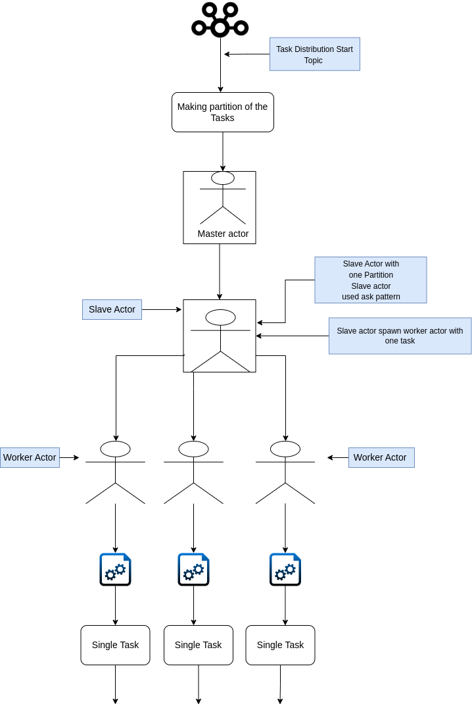

= Distributed_System

Distributed system design with apache kafka and actor model

Architectural Diagram of the distributed system is shown below

**Monitoring Kafka
**

Here I am using KafDrop for monitoring the kafka topics, clusters and the partitions.

Kafdrop is a web-based UI for monitoring Apache Kafka clusters. It provides real-time monitoring and management capabilities for Kafka topics, brokers, partitions, and consumer groups. Kafdrop is an open-source project that can be easily deployed and used to monitor and manage Kafka clusters.

